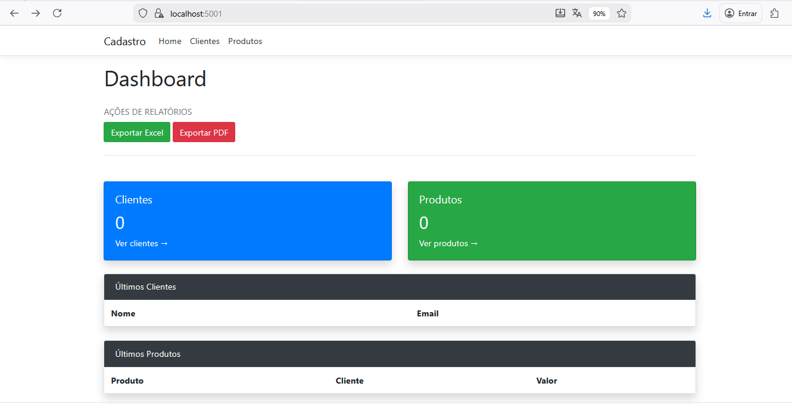
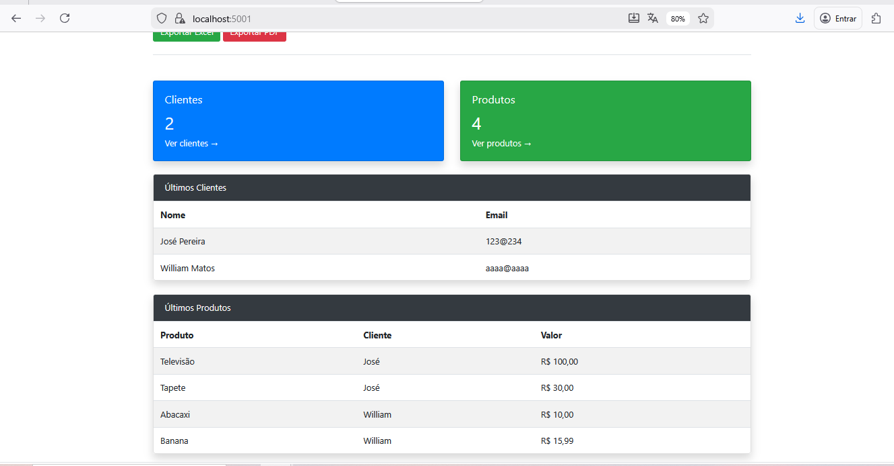
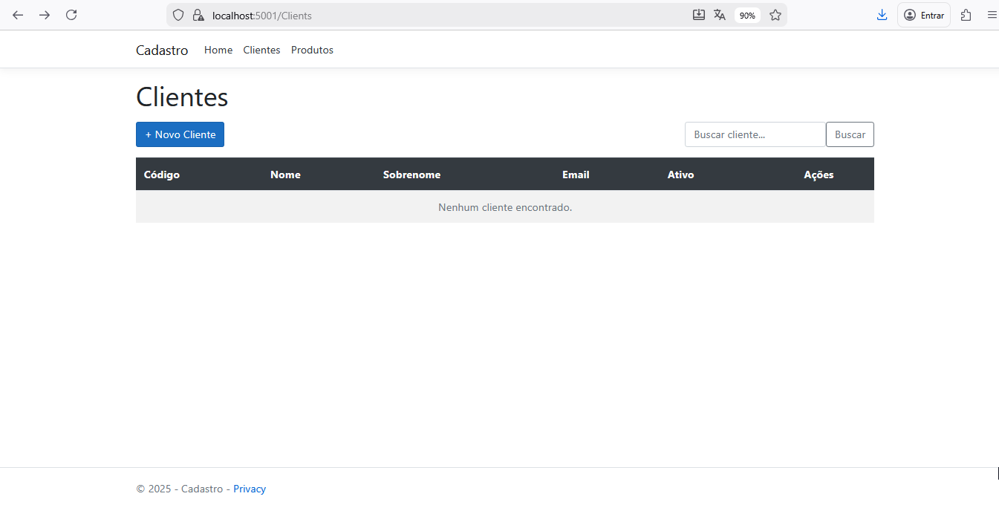
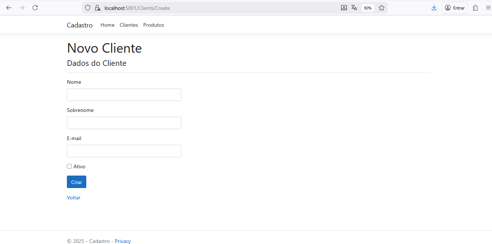
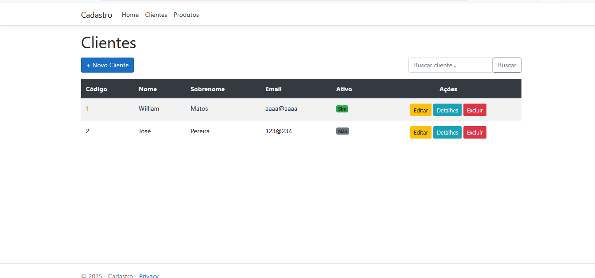
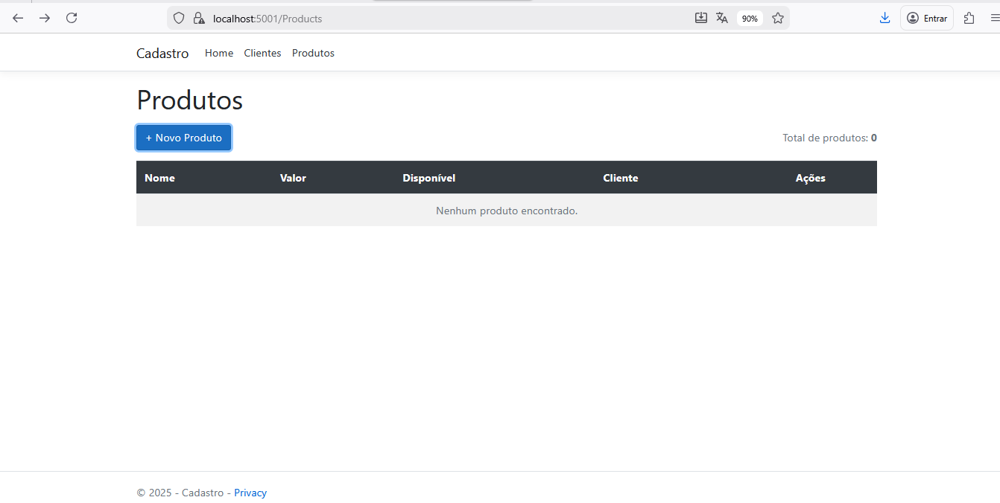
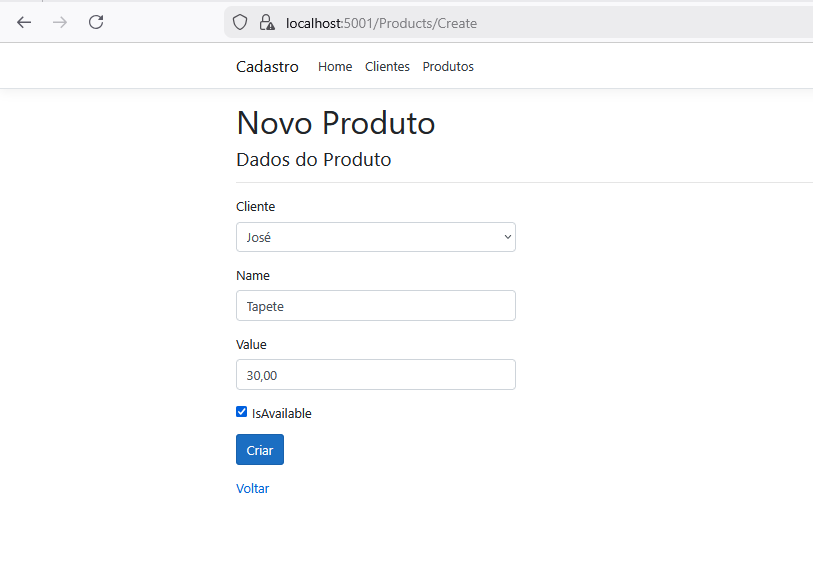
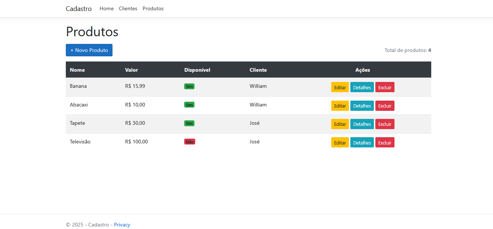
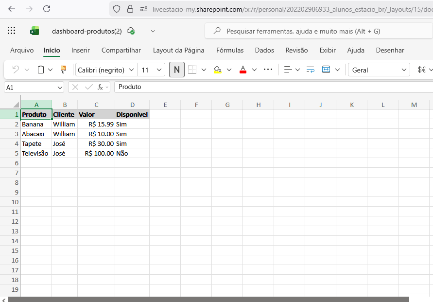
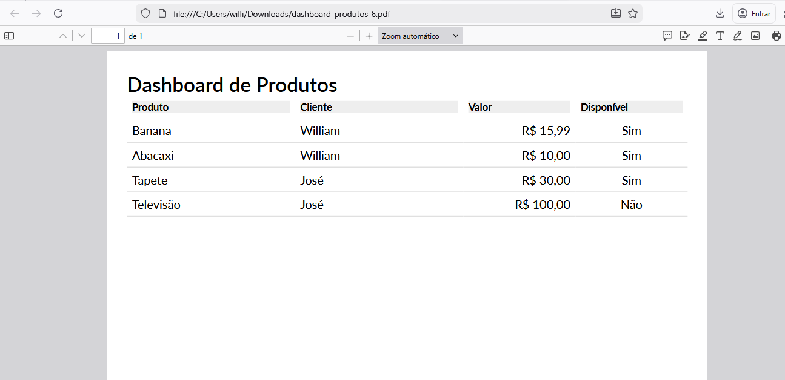

# Sistema de Cadastro de Clientes e Produtos

Aplicação web desenvolvida em **ASP.NET Core 6.0**, utilizando o padrão **MVC**, para gerenciamento de **clientes e produtos**, com funcionalidades completas de **CRUD**, importação e exportação de dados em **Excel** e **PDF**, além de dashboard com informações consolidadas.

## Funcionalidades

- Cadastro, edição, listagem e exclusão de **Clientes**
- Cadastro, edição, listagem e exclusão de **Produtos**
- Associação de produtos a clientes
- Dashboard com:
  - Total de clientes
  - Total de produtos
  - Últimos clientes cadastrados
  - Últimos produtos cadastrados
- Exportação de dados para:
  - 📊 **Excel (.xlsx)**
  - 📄 **PDF**
- Importação de produtos via arquivo **Excel**
- Validação de formulários no front-end
- Formatação monetária em **Real (R$)**

## Arquitetura

O projeto segue boas práticas de organização e separação de responsabilidades:

- **ASP.NET Core MVC**
- Camadas bem definidas:
  - Controllers
  - Views
  - Domain
  - Infrastructure
  - ViewModels
- Padrões e princípios:
  - Clean Code
  - SOLID
  - MVC

## Tecnologias Utilizadas

### Backend
- **C#**
- **ASP.NET Core 6.0**
- **Entity Framework Core**
- **InMemory Database** (facilita testes e execução local)

### Frontend
- **Razor Pages (Views)**
- **HTML5**
- **CSS3**
- **Bootstrap**
- **jQuery**
- **jQuery Validation**
- **Globalize.js** (formatação e validação monetária pt-BR)

### Relatórios e Arquivos
- **ClosedXML** → Exportação e importação de Excel
- **QuestPDF** → Geração de relatórios em PDF

### Ferramentas
- Git
- GitHub
- Visual Studio / VS Code

## Exemplos de Exportação

- **Excel (.xlsx)** com:
  - Produto
  - Cliente
  - Valor
  - Disponibilidade

- **PDF** formatado com:
  - Tabela organizada
  - Valores monetários em R$
  - Paginação automática


## 📸 Screenshots do Sistema
  
  ### 📊 Dashboard
  Visão geral do sistema com indicadores e acesso rápido aos relatórios.
  
  Dashboard vazio (antes de ser preenchido):
  
  
  
  Dashboard após cadastro de dados (depois de ser preenchido):
  
  
  
  ---
  
  ### 👤 Cadastro de Clientes
  Listagem e criação de clientes no sistema.
  
  Menu Clientes (antes de estar preenchido):
  
  
  
  Tela de criação de cliente (sem estar preenchida):
  
  
  
  Tela de clientes preenchida:
  
  
  
  ---
  
  ### 📦 Cadastro de Produtos
  Listagem e cadastro de produtos associados a clientes.
  
  Tela de Produtos (antes de ser preenchido):
  
  
  
  Tela de criação de produto (com tudo preenchido):
  
  
  
  Tela de Produtos preenchida:
  
  
  
  ---
  
  ### 📑 Relatórios
  Exportação de dados em Excel e PDF.
  
  Relatório em Excel (já exportado e preenchido):
  
  
  
  Relatório em PDF (preenchido):
  
  
  
  ---
## Como executar o projeto

### Pré-requisitos
- .NET SDK **6.0** ou superior
- Visual Studio ou VS Code

## ▶️ Como Executar o Projeto

```bash
# 1. Clonar o repositório
git clone https://github.com/will759/SistemaCadastroClientesProdutos

# 2. Acessar a pasta do projeto
cd SistemaCadastroClientesProdutos

# 3. Restaurar as dependências
dotnet restore

# 4. Executar a aplicação
dotnet run

# Acesse no navegador

https://localhost:5001

```

Objetivo do Projeto

Este projeto foi desenvolvido com foco em aprendizado prático, aplicando conceitos de:

Desenvolvimento Web com .NET

Padrão MVC

Manipulação de dados

Geração de relatórios

Boas práticas de código

 Autor

William de Matos Pereira

Estudante de Ciência da Computação

Desenvolvedor Full-Stack (.NET)
